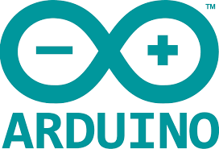

# Hacksessible Electronics Repository

Here you can find resources on Arduino and components used for the Hacksessible 2019 challenge.  
Feel free to fork the repository and modify the source code for your own projects !  

* [Installing Arduino (Windows)](https://www.arduino.cc/en/guide/windows)
* [Installing Arduino (Linux)](https://www.arduino.cc/en/guide/linux)
* [Arduino Tutorials](resources/tutorials)
    * [Short Intro](resources/tutorials/arduino.pdf)
    * [Intermediate](resources/tutorials/starter_kit_manual.pdf)
    * [In Depth](resources/tutorials/arduino_in_depth_1.pdf)
    * [In Depth #2](resources/tutorials/arduino_in_depth_2.pdf) 
* [Using The Libraries]()
* [Getting On Slack]()

### Join Us on Slack !

* [Hacksessible Electronics Slack Channel](https://get.slack.help/hc/en-gb/articles/218080037-Getting-started-for-new-members)

### Useful links
* [Hacksessible Website](https://www.hackcessible.org/)  

Credits:
* Manuals from:
    * https://www.makerspaces.com/
    * https://www.elecrow.com
    * http://www.funduino.de
    * https://bastiaanvanhengel.com/